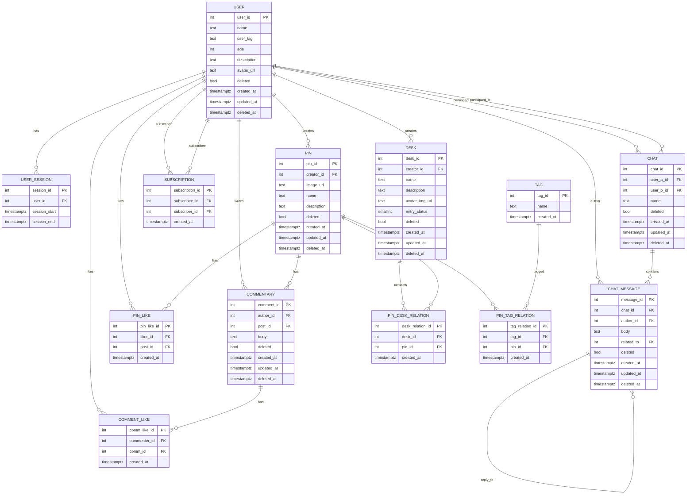

# Схема БД

## Дополнительные хранилища
Помимо postgreSQL, используется Redis и MinIO
### Redis
Redis — для хранения сессий(чаты и заход/выход пользователя)

#### Сессии
**`session:{session_id}`** — hash. Одна активная сессия пользователя.
- `user_id` (integer) — id пользователя из `Postgres.USER.user_id`.
- `ip` (string) — IP-адрес, с которого установлена сессия.
- `created_at` (timestamp) — момент логина. Показывает, когда началась сессия; нужен для аналитики длительности.
- `last_activity` (timestamp) — момент последнего действия. Обновляется при каждом запросе;

#### Чат
**`chat:online:{user_id}`** — string. тут хранится `last_activity` (timestamp последнего WebSocket-пинга или сообщения).
**`chat:typing:{chat_id}:{user_id}`** — string.
**`chat:unread:{user_id}:{chat_id}`** — string (integer) счётчик непрочитанных сообщений.

### MinIO / S3
MinIO — Для хранения Пинов и аватарок(в PostgreSQL для файлов есть только неудобный и слишком ёмкий формат blob)

#### Bucket `avatars`
Хранит аватары пользователей.
Связь с Postgres: `Postgres.USER.avatar_url` → URL или ключ в этом bucket'е.

#### Bucket `pins`
Хранит изображения пинов.
Связь с Postgres: `Postgres.PIN.image_url` → URL или ключ в этом bucket'е.

#### Bucket `desks`
Хранит обложки досок.
Связь с Postgres: `Postgres.DESK.avatar_img_url` → URL или ключ в этом bucket'е.
